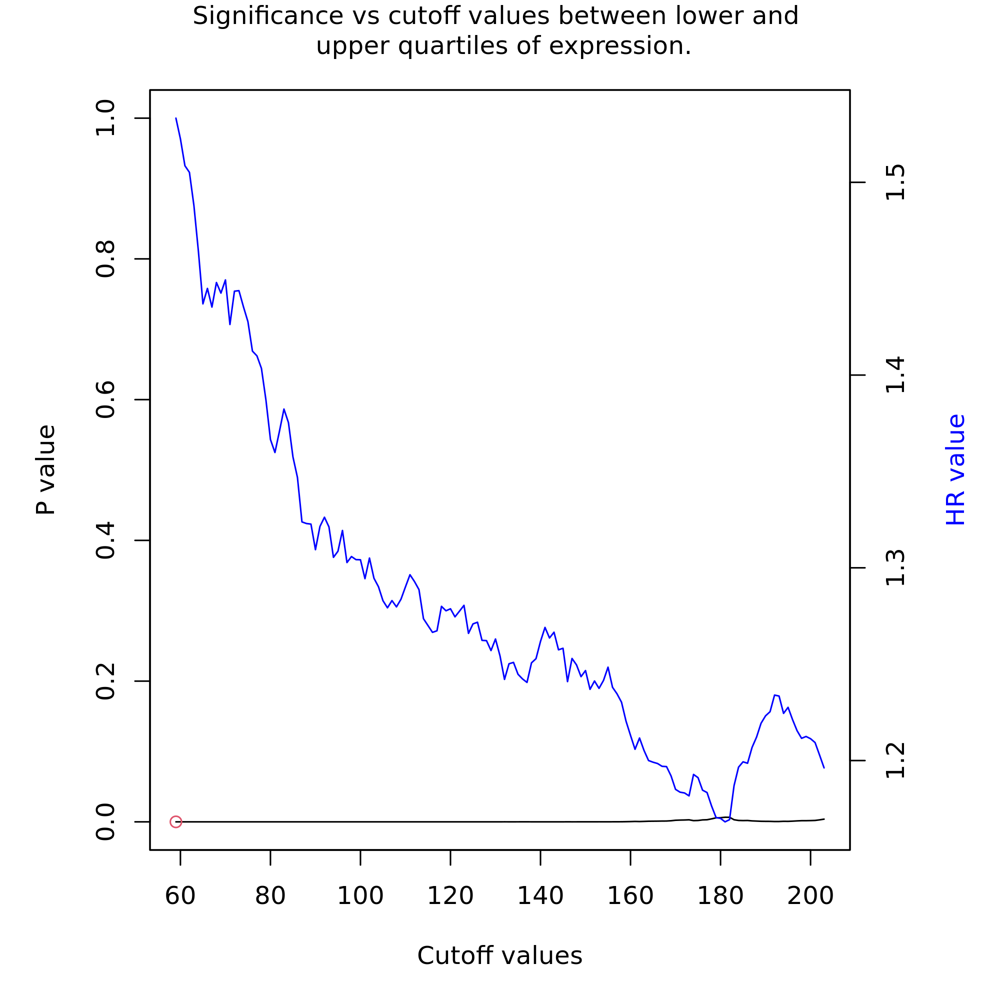
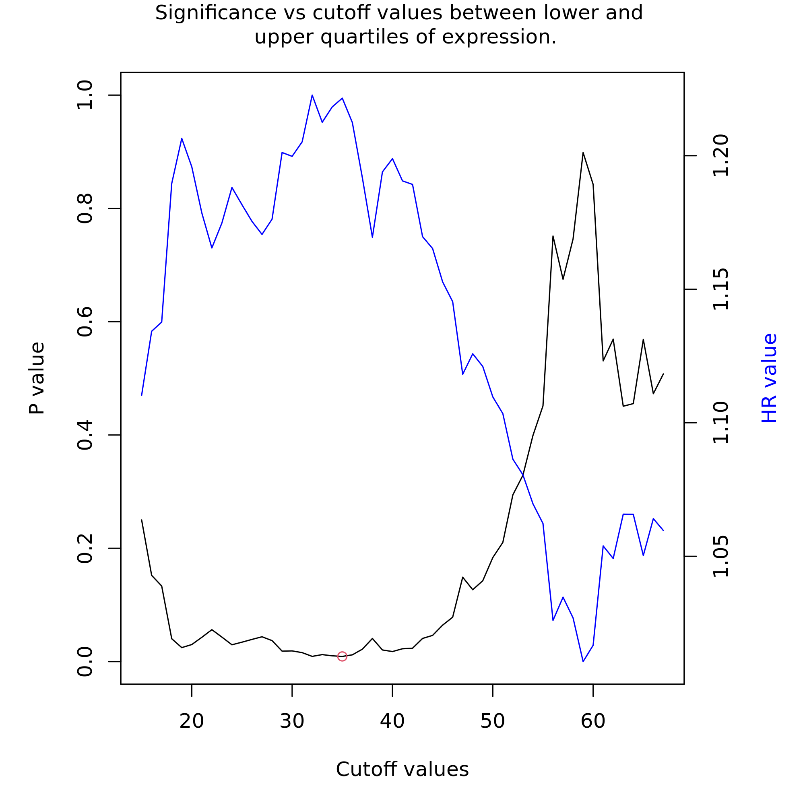
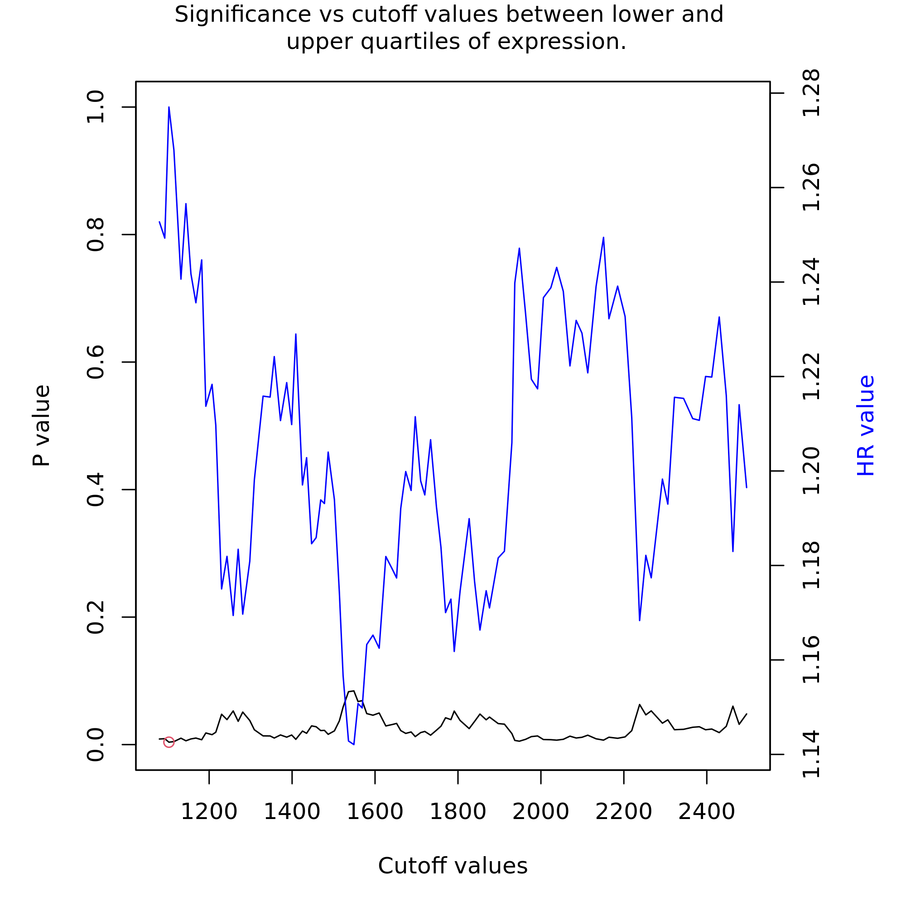
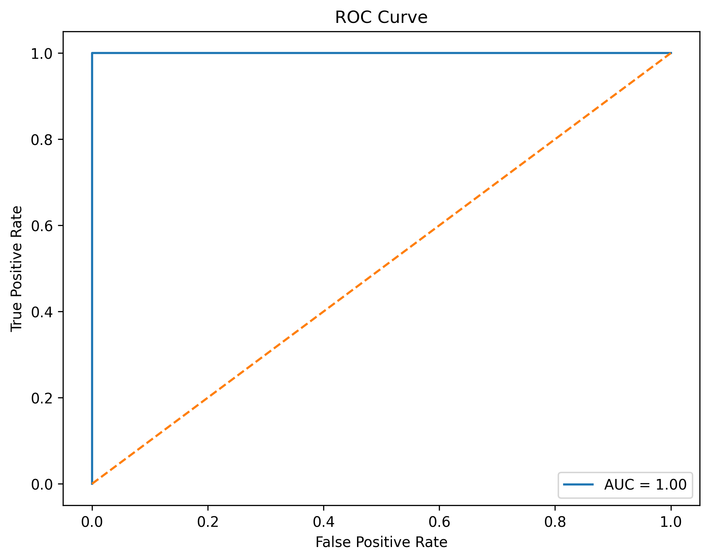
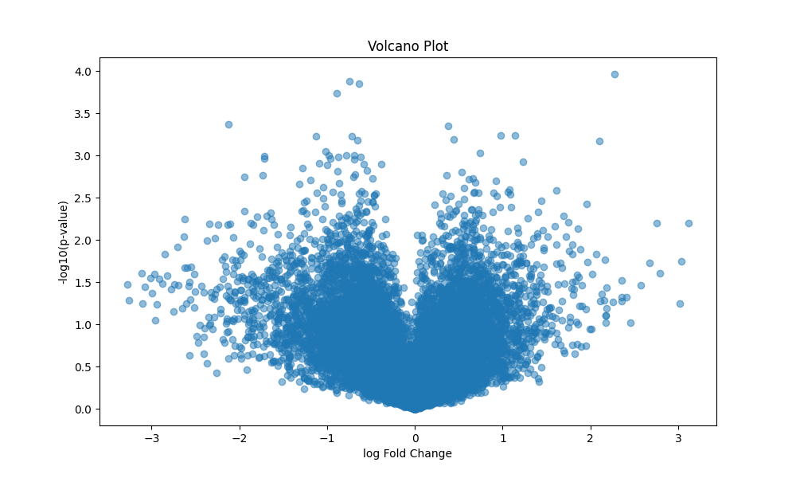
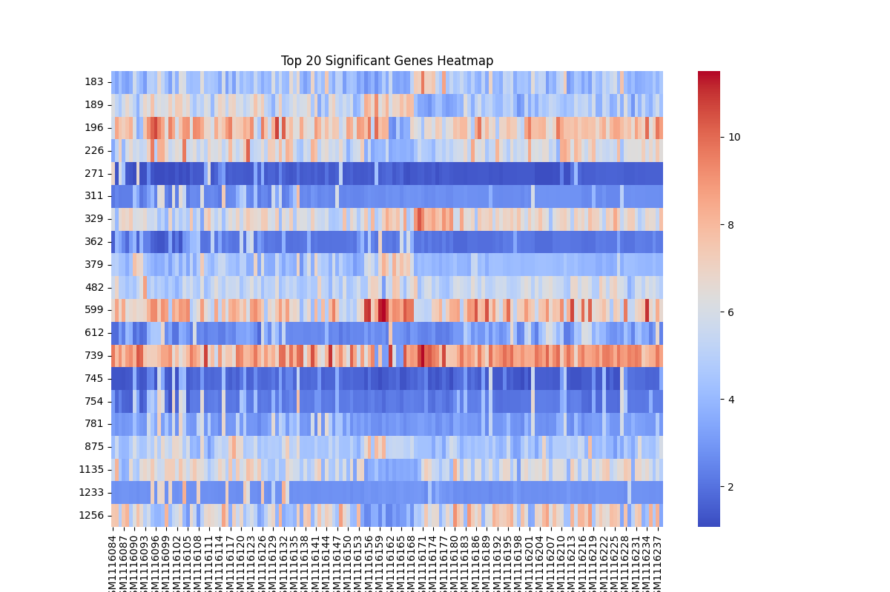
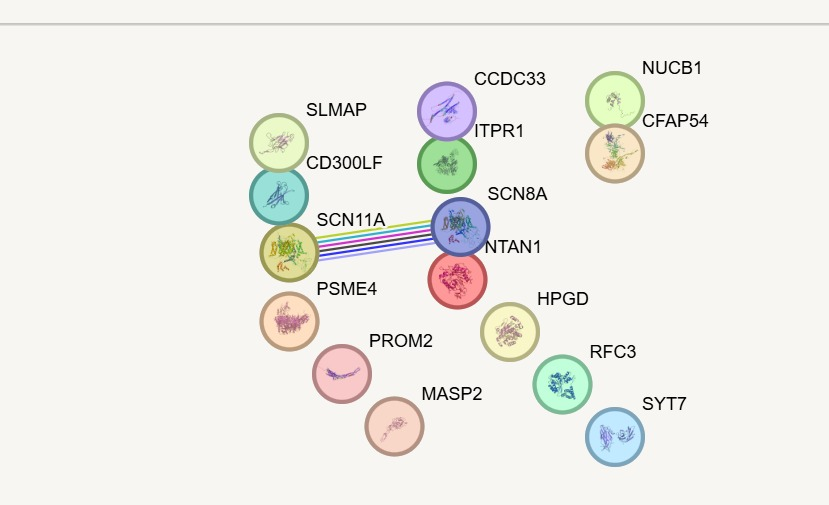
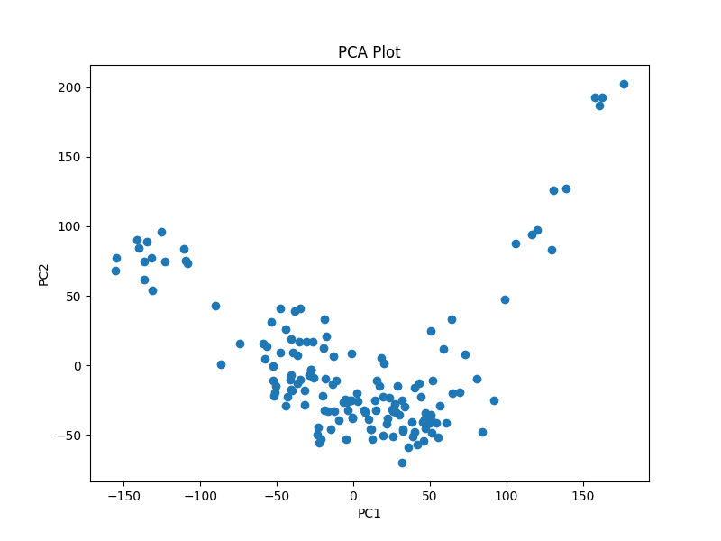

# Integrated Machine Learning and Survival-Based Biomarker Discovery in Breast Cancer

## Objective

This project aims to identify prognostic breast cancer biomarkers using machine learning, differential gene expression analysis, functional enrichment, and survival analysis.

## Dataset

- GEO Dataset: GSE45827
- Platform: GPL570
- Source: NCBI GEO

## Methods

- Data preprocessing
- Differential gene expression analysis
- Volcano plot visualization
- Heatmap analysis
- PCA analysis
- Machine learning classification
  - Random Forest
  - Logistic Regression
  - SVM
- Feature importance analysis
- Functional enrichment analysis
  - GO analysis
  - KEGG pathway analysis
  - Enrichr
- STRING protein interaction network
- Kaplan-Meier survival analysis
- ROC curve analysis

## Results

- Random Forest achieved high classification accuracy (~96%)
- Significant prognostic biomarkers identified:
  - RFC3
  - MASP2
  - PROM2
- Kaplan-Meier analysis demonstrated significant survival association
- Functional enrichment identified cancer-related pathways and biological processes

## Visualizations

# Breast Cancer Biomarker Discovery using ML

## Kaplan Meier Plot - MASP2

## Kaplan Meier Plot - RFC3

## Kaplan Meier Plot - PROM2

## ROC Curve

## Volcano Plot

## Heatmap

## STRING Network

## PCA Plot

## Complete Analysis Notebook

The complete workflow including preprocessing, machine learning, enrichment analysis, and survival analysis is available here:

[Open Notebook](notebooks/Breast_Cancer_Biomarker_Discovery.ipynb)

## Conclusion

This study demonstrates an integrated bioinformatics and machine learning framework for identifying prognostic biomarkers in breast cancer. The identified genes may contribute to improved diagnosis and therapeutic targeting.

## Skills Used

Python, Pandas, Scikit-learn, Bioinformatics, Machine Learning, Functional Genomics, Survival Analysis, Data Visualization
